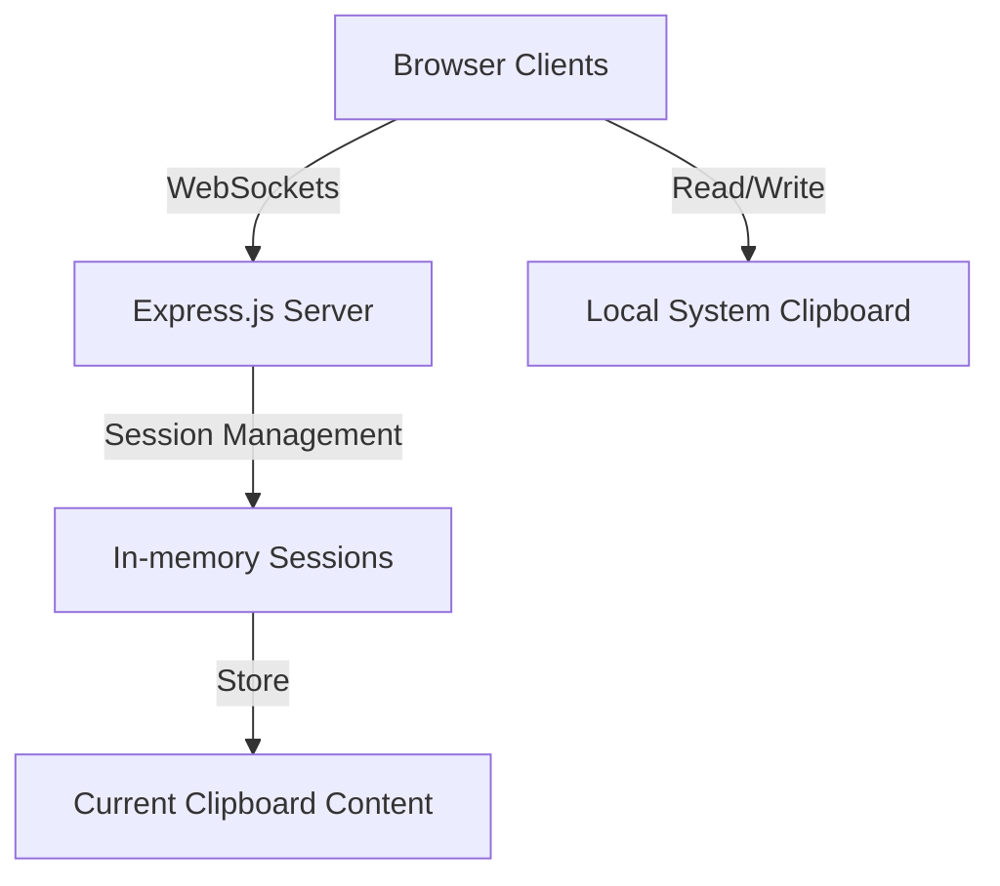

# System Patterns: ClipShare

## Architecture Overview

ClipShare follows a client-server architecture with real-time communication:

## Core System Components

### 1. Session Management System
- **Purpose**: Handles authentication, session creation, and session membership
- **Design Pattern**: Singleton service with module pattern
- **Key Features**:
  - Session creation with passphrase authentication
  - In-memory storage of session data
  - Client tracking within sessions

### 2. Clipboard Synchronization Engine
- **Purpose**: Monitors, broadcasts, and synchronizes clipboard changes
- **Design Pattern**: Observer pattern via WebSockets
- **Key Features**:
  - Real-time broadcasting of clipboard changes
  - Efficient content diffing to reduce unnecessary updates
  - Conflict resolution (last update wins)

### 3. Client-side Clipboard Monitor
- **Purpose**: Detects local clipboard changes and applies remote changes
- **Design Pattern**: Polling pattern with event-driven updates
- **Key Features**:
  - Clipboard API integration with permissions handling
  - Polling mechanism for platforms without clipboard event API
  - Change detection algorithm to avoid redundant updates

### 4. Authentication Flow
- **Purpose**: Secures sessions with simple passphrase verification
- **Design Pattern**: Token-based authentication with local storage
- **Key Features**:
  - Session persistence across page reloads
  - Join existing session with correct passphrase
  - Auto-reconnection on disconnects

## Communication Patterns

### WebSocket Event System
The application uses a well-defined WebSocket event system:

| Event                | Direction        | Purpose                                       |
|----------------------|------------------|-----------------------------------------------|
| join-session         | Client → Server  | Authenticate and join a session               |
| clipboard-update     | Client → Server  | Send new clipboard content to server          |
| clipboard-broadcast  | Server → Client  | Broadcast clipboard update to other clients   |
| client-joined        | Server → Client  | Notify when a new client joins the session    |
| client-left          | Server → Client  | Notify when a client leaves the session       |

### State Management
- **Server State**: Maintained in-memory with session isolation
- **Client State**: Combination of local storage and memory for session persistence

## Error Handling Strategy
- **Network Disruptions**: Auto-reconnection with exponential backoff
- **Authentication Failures**: Clear error messaging with redirect to login
- **Clipboard API Errors**: Graceful degradation with manual clipboard controls
- **Permissions Issues**: Clear guidance for clipboard permission requests

## Performance Considerations
- **Efficient Content Diffing**: Only sync changes when content actually differs
- **Throttled Updates**: Limit update frequency to prevent excessive network traffic
- **Lazy Reconnection**: Exponential backoff for reconnection attempts

## Security Model
- **Session Isolation**: Content is isolated to specific session groups
- **Passphrase Protection**: Simple but effective barrier for casual use
- **No Persistence**: Clipboard data only stored in memory, not persisted to disk
- **Frontend Security**: No clipboard content in URLs or exposed parameters

## Extensibility Points
The system is designed with the following extension points:

1. **Storage Adapters**: Can replace in-memory storage with persistent storage
2. **Authentication Providers**: Can enhance simple passphrase with more robust auth
3. **Content Type Handlers**: Architecture supports adding new clipboard formats
4. **Transport Security**: Can add encryption layer for sensitive environments
