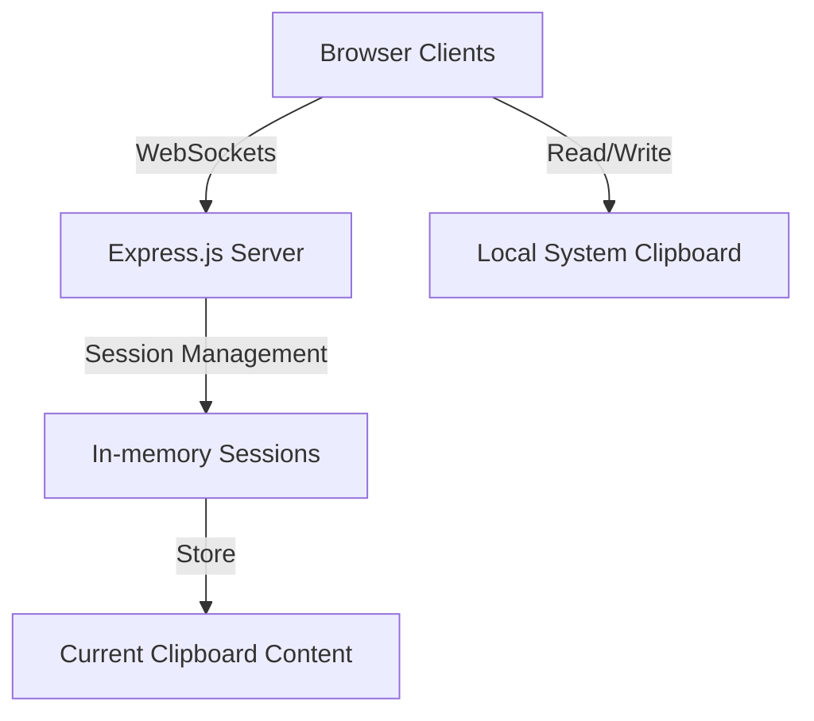

# System Patterns: ClipShare

## Architecture Overview

ClipShare follows a client-server architecture with real-time communication:

## Core System Components

### 1. Session Management System
- **Purpose**: Handles authentication, session creation, and session membership
- **Design Pattern**: Singleton service with module pattern
- **Key Features**:
  - Session creation with passphrase authentication
  - In-memory storage of session data
  - Client tracking within sessions
- **Authentication Storage**:
  - Local persistence via localStorage
  - **Standard Key: 'clipshare_session'** - Must be consistent across codebase
  - JSON-formatted auth data: `{sessionId, passphrase, timestamp}`

### 2. Clipboard Synchronization Engine
- **Purpose**: Monitors, broadcasts, and synchronizes clipboard changes
- **Design Pattern**: Observer pattern via WebSockets
- **Key Features**:
  - Real-time broadcasting of clipboard changes
  - Efficient content diffing to reduce unnecessary updates
  - Conflict resolution (last update wins)
  - Content hashing for deduplication
  - Time-based throttling to prevent ping-pong effects
  - Content-type specific handling (text vs images)

#### Content Deduplication System
- **Purpose**: Prevents circular updates between clients
- **Design Pattern**: Hash-based equality with throttling
- **Key Components**:
  - Server-side content hash tracking with timestamps
  - Client-side window identification via sessionStorage
  - Multi-sample hashing for reliable image comparison
  - Normalized content comparison that ignores metadata
  - Specialized grace periods based on content type (longer for images)

### 3. Client-side Clipboard Monitor
- **Purpose**: Detects local clipboard changes and applies remote changes
- **Design Pattern**: Polling pattern with event-driven updates
- **Key Features**:
  - Clipboard API integration with permissions handling
  - Polling mechanism for platforms without clipboard event API
  - Change detection algorithm to avoid redundant updates

### 4. Authentication Flow
- **Purpose**: Secures sessions with simple passphrase verification
- **Design Pattern**: Token-based authentication with local storage
- **Key Features**:
  - Session persistence across page reloads
  - Join existing session with correct passphrase
  - Auto-reconnection on disconnects
- **Critical Implementation Note**:
  - Must consistently use 'clipshare_session' as the localStorage key
  - Breaking this consistency causes authentication loops and session failures
  - Avoid using variations (e.g., 'clipboard-session') to prevent confusion

## Communication Patterns

### WebSocket Event System
The application uses a well-defined WebSocket event system:

| Event                | Direction        | Purpose                                       |
|----------------------|------------------|-----------------------------------------------|
| join-session         | Client → Server  | Authenticate and join a session               |
| clipboard-update     | Client → Server  | Send new clipboard content to server          |
| clipboard-broadcast  | Server → Client  | Broadcast clipboard update to other clients   |
| client-joined        | Server → Client  | Notify when a new client joins the session    |
| client-left          | Server → Client  | Notify when a client leaves the session       |

### State Management
- **Server State**: Maintained in-memory with session isolation
- **Client State**: Combination of local storage and memory for session persistence

## Error Handling Strategy
- **Network Disruptions**: Auto-reconnection with exponential backoff
- **Authentication Failures**: Clear error messaging with redirect to login
- **Clipboard API Errors**: Graceful degradation with manual clipboard controls
- **Permissions Issues**: Clear guidance for clipboard permission requests
- **Missing Functions**: Defensive coding to check if functions exist before calling

## Utility Functions

### File Handling Utilities
- **Purpose**: Support file-related operations with consistent patterns
- **Design Pattern**: Pure utility functions with single responsibility
- **Key Functions**:
  - `getFileExtension(fileName, mimeType)` - Extracts extension from filename or falls back to mime type
  - `getMimeTypeFromExtension(fileName)` - Maps file extensions to appropriate MIME types
  - `formatFileSize(bytes)` - Formats byte counts to human-readable sizes with units
  - `dataURLtoBlob(dataUrl)` - Converts Data URLs to Blob objects for clipboard operations

## Performance Considerations
- **Efficient Content Diffing**: Only sync changes when content actually differs
- **Throttled Updates**: Limit update frequency to prevent excessive network traffic
- **Lazy Reconnection**: Exponential backoff for reconnection attempts

## Security Model
- **Session Isolation**: Content is isolated to specific session groups
- **Passphrase Protection**: Simple but effective barrier for casual use
- **No Persistence**: Clipboard data only stored in memory, not persisted to disk
- **Frontend Security**: No clipboard content in URLs or exposed parameters

## Code Stability Practices
- **Stable Commit Reference**: db428d57 established as baseline for stable functionality
- **Incremental Changes**: Make focused changes to address specific issues rather than broad refactoring
- **Function Availability Checks**: Verify functions exist before calling them
- **Consistent Key Naming**: Standardize localStorage key names across authentication flows
- **Testing Before Merging**: Thoroughly test changes to authentication or core functionality before merging to main
- **Git Rollback Procedure**: Document process for reverting to stable state when necessary

## Extensibility Points
The system is designed with the following extension points:

1. **Storage Adapters**: Can replace in-memory storage with persistent storage
2. **Authentication Providers**: Can enhance simple passphrase with more robust auth
3. **Content Type Handlers**: Architecture supports adding new clipboard formats
4. **Transport Security**: Can add encryption layer for sensitive environments
