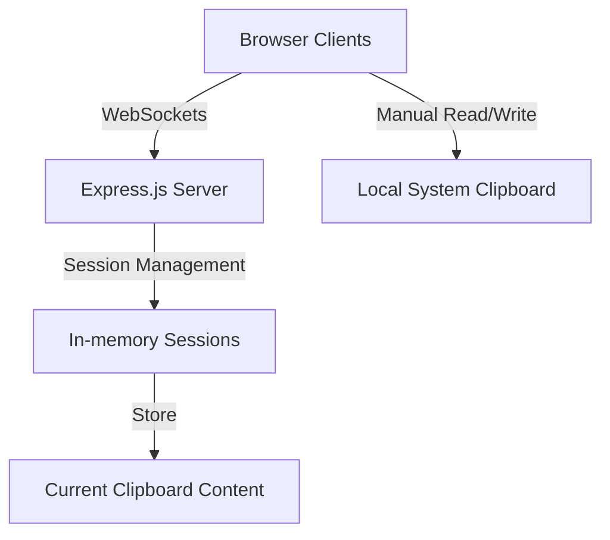

# System Patterns: ClipShare

## Architecture Overview

ClipShare follows a client-server architecture with real-time communication:



## Core System Components

### 1. Session Management System
- **Purpose**: Handles authentication, session creation, and session membership
- **Design Pattern**: Singleton service with module pattern
- **Key Features**:
  - Session creation with passphrase authentication
  - In-memory storage of session data
  - Client tracking within sessions
- **Authentication Storage**:
  - Local persistence via localStorage
  - **Standard Key: 'clipshare_session'** - Must be consistent across codebase
  - JSON-formatted auth data: `{sessionId, passphrase, timestamp}`

### 2. Clipboard Synchronization Engine
- **Purpose**: Facilitates manual clipboard content sharing between devices
- **Design Pattern**: Manual user-initiated events via WebSockets
- **Key Features**:
  - Real-time broadcasting of clipboard changes
  - Simple content passing between clients through the server
  - Conflict resolution (last update wins)
  - Content-type specific handling (text vs images)

#### Simplified Content Synchronization
- **Purpose**: Provides clear, predictable clipboard synchronization across devices
- **Design Pattern**: Manual user-initiated operations
- **Key Components**:
  - Client-side "Paste" button to read from system clipboard
  - Client-side "Copy" button to write to system clipboard
  - Immediate broadcast of changes to all connected clients
  - No automatic monitoring or complex content comparison
  - Simplified server-side architecture that acts as pure pass-through

### 3. Clipboard Utilities
- **Purpose**: Provides functions to read from and write to the system clipboard
- **Design Pattern**: Utility functions with browser fallbacks
- **Key Features**:
  - Clipboard API integration with permissions handling
  - Multiple fallback methods for cross-browser compatibility
  - Support for text and image content types

### 4. Enhanced Secure Authentication System
- **Purpose**: Secures sessions with client-side encryption and quorum-based verification
- **Design Pattern**: Client-side encryption with AES + quorum-based authorization
- **Key Features**:
  - Client-side encryption using AES (via CryptoJS)
  - Passphrases never transmitted to server - only encrypted verification data
  - Quorum-based verification where existing authorized clients verify new ones
  - Session banning for suspected security breaches (10-minute timeout)
  - Session persistence across page reloads
  - Auto-reconnection on disconnects
- **Authentication Process**:
  ```mermaid
  sequenceDiagram
    participant Client as New Client
    participant Server
    participant Auth as Authorized Clients
    
    Client->>Server: 1. Check if session exists
    Server->>Client: Session status (exists/active)
    
    alt New Session
        Client->>Server: Create new session (sessionId)
        Server->>Client: Session created (auto-authorized)
    else Join Existing Session
        Client->>Server: Request join (encrypted verification)
        Server->>Auth: Broadcast verification request
        Auth->>Server: Verification results
        Server->>Client: Verification result (approved/denied)
    end
  ```
- **Critical Implementation Note**:
  - Uses 'clipshare_session' as the localStorage key consistently
  - Encrypted verification proves knowledge of passphrase without transmitting it
  - Server maintains list of authorized clients per session

## Communication Patterns

### WebSocket Event System
The application uses a well-defined WebSocket event system:

| Event                    | Direction        | Purpose                                          |
|--------------------------|------------------|--------------------------------------------------|
| check-session-exists     | Client → Server  | Check if a session exists and has active clients |
| create-new-session       | Client → Server  | Create and automatically authorize a new session |
| request-session-join     | Client → Server  | Request to join with encrypted verification      |
| verify-join-request      | Server → Client  | Ask authorized clients to verify a join request  |
| submit-verification-result | Client → Server | Submit result of verification check             |
| verification-result      | Server → Client  | Notify client of verification acceptance/denial  |
| clipboard-update         | Client → Server  | Send new clipboard content to server             |
| clipboard-broadcast      | Server → Client  | Broadcast clipboard update to other clients      |
| client-joined            | Server → Client  | Notify when a new client joins the session       |
| client-left              | Server → Client  | Notify when a client leaves the session          |
| session-banned           | Server → Client  | Notify that a session has been banned            |

### State Management
- **Server State**: Maintained in-memory with session isolation
- **Client State**: Combination of local storage and memory for session persistence

## Error Handling Strategy
- **Network Disruptions**: Auto-reconnection with exponential backoff
- **Authentication Failures**: Clear error messaging with redirect to login
- **Clipboard API Errors**: 
  - Graceful degradation with manual clipboard controls
  - Auto-disappearing error messages (5-second timeout)
  - Contextual error handling based on error type
- **Permissions Issues**: Clear guidance for clipboard permission requests
- **Missing Functions**: Defensive coding to check if functions exist before calling

## Utility Functions

### File Handling Utilities
- **Purpose**: Support file-related operations with consistent patterns
- **Design Pattern**: Pure utility functions with single responsibility
- **Key Functions**:
  - `getFileExtension(fileName, mimeType)` - Extracts extension from filename or falls back to mime type
  - `getMimeTypeFromExtension(fileName)` - Maps file extensions to appropriate MIME types
  - `formatFileSize(bytes)` - Formats byte counts to human-readable sizes with units
  - `dataURLtoBlob(dataUrl)` - Converts Data URLs to Blob objects for clipboard operations

## Performance Considerations
- **Simplified Architecture**: Eliminated complex monitoring and comparison logic
- **User-driven Updates**: Updates only occur when explicitly triggered by user
- **Lazy Reconnection**: Exponential backoff for reconnection attempts

## Security Model
- **Session Isolation**: Content is isolated to specific session groups
- **Client-side Encryption**: Passphrases never transmitted to server
- **Quorum Verification**: Existing authorized clients verify new ones
- **Session Banning**: Temporary bans (10 minutes) for suspected security breaches
- **No Persistence**: Clipboard data only stored in memory, not persisted to disk
- **Frontend Security**: No clipboard content in URLs or exposed parameters
- **Authorization Checks**: All content updates verified against authorized client list

## Code Stability Practices
- **Stable Commit Reference**: db428d57 established as baseline for stable functionality
- **Incremental Changes**: Make focused changes to address specific issues rather than broad refactoring
- **Function Availability Checks**: Verify functions exist before calling them
- **Consistent Key Naming**: Standardize localStorage key names across authentication flows
- **Testing Before Merging**: Thoroughly test changes to authentication or core functionality before merging to main
- **Git Rollback Procedure**: Document process for reverting to stable state when necessary

## Extensibility Points
The system is designed with the following extension points:

1. **Storage Adapters**: Can replace in-memory storage with persistent storage
2. **Authentication Providers**: Can enhance simple passphrase with more robust auth
3. **Content Type Handlers**: Architecture supports adding new clipboard formats
4. **Transport Security**: Can add encryption layer for sensitive environments
